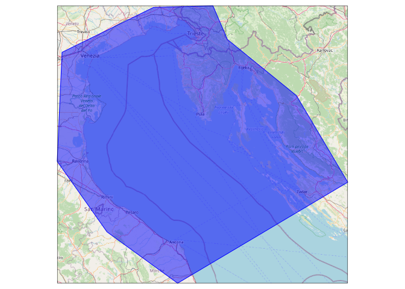
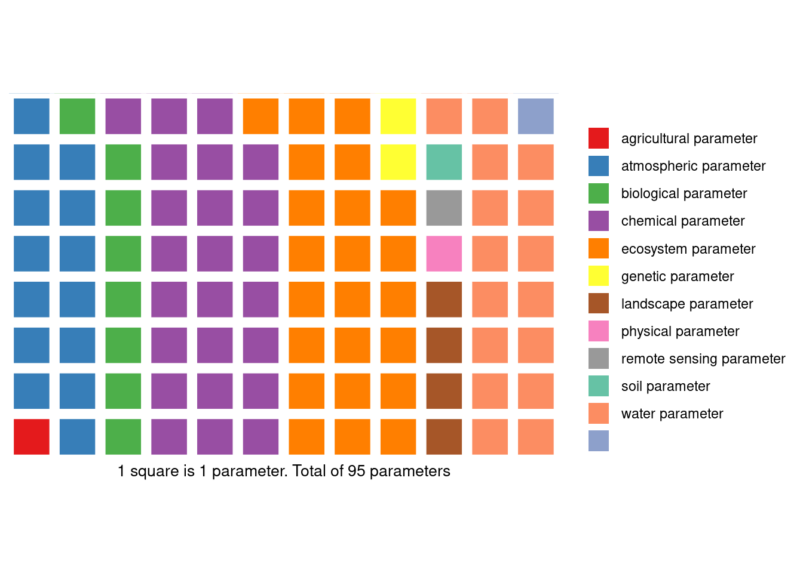
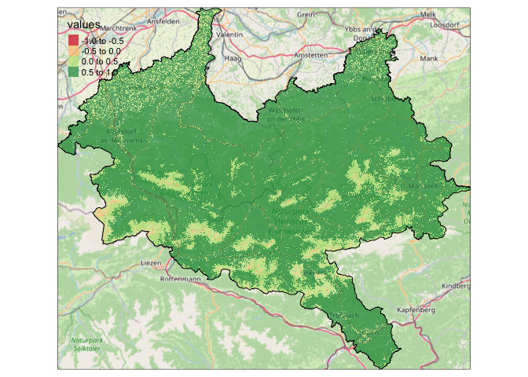
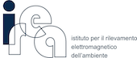

ReLTER
================

<!-- README.md is generated from README.Rmd. Please edit that file -->
<!-- badges: start -->
<!-- other badges https://github.com/GuangchuangYu/badger -->
<!-- DOI badge -->

[](https://doi.org/10.5281/zenodo.5576813)
<!-- the version is determined via the DESCRIPTION file -->
[](https://github.com/oggioniale/ReLTER)
<!-- CRAN badges -->
<!-- [](https://cran.r-project.org/package=oggioniale/ReLTER) -->
<!-- [](https://cran.r-project.org/web/checks/check_results_ReLTER.html) -->
<!-- [](https://cran.r-project.org/package=badger) -->
<!-- [](https://www.rdocumentation.org/packages/ReLTER) -->
<!-- work on github -->
[](https://github.com/oggioniale/ReLTER)
[](https://github.com/oggioniale/ReLTER/commits/main)
[](https://cran.r-project.org/web/licenses/GPL-3.0)
[](https://www.repostatus.org/#active)
[](https://lifecycle.r-lib.org/articles/stages.html#stable)

<!-- Once you have submitted a package and it has passed editor checks, add a peer-review badge via -->
<!-- [](https://github.com/ropensci/software-review/issues/485) -->
<!-- where issue_id is the number of the issue in the software-review repository. -->

[](https://github.com/rossellhayes/ipa/actions)
[](https://codecov.io/gh/oggioniale/ReLTER)

<!-- badges: end -->

`{ReLTER}` is an R package that provides access to
[DEIMS-SDR](https://deims.org/), allowing to interact with software
implemented by eLTER Research Infrastructure (RI) and improving the
data/information shared among the Long Term Ecological Research (LTER)
network. This package was conceived within eLTER H2020 project and will
help advance the development of European Long-Term Ecosystem Research
Infrastructures ([eLTER RI](https://elter-ri.eu)).

The `{ReLTER}` package functions in particular allow to:

-   retrieve the information about entities (e.g. sites, datasets, and
    activities) shared by [DEIMS-SDR](https://deims.org/) (see e.g.
    [get_site_info
    function](https://oggioniale.github.io/ReLTER/reference/get_site_info.html));

-   elaborate the information of single site or merge info from national
    network sites or entire International LTER (ILTER) in order to
    provide maps, figures, graphs etc (see e.g.
    [get_network_sites](https://oggioniale.github.io/ReLTER/reference/get_network_sites.html),
    [produce_site_map](https://oggioniale.github.io/ReLTER/reference/produce_site_map.html)
    or
    [produce_site_parameters_pie](https://oggioniale.github.io/ReLTER/reference/produce_site_parameters_pie.html)
    functions);

-   interact with the [ODSEurope](maps.opendatascience.eu) managed by
    members of the
    [Geo-harmonizer](https://opendatascience.eu/geoharmonizer-project/)
    project starting with the dataset shared by
    [DEIMS-SDR](https://deims.org/) (see e.g.
    [get_site_ODS](https://oggioniale.github.io/ReLTER/reference/get_site_ODS.html)
    function);

-   improve the quality of the dataset (see e.g.
    [get_id_worms](https://oggioniale.github.io/ReLTER/reference/get_id_worms.html)).

Functions currently implemented are derived from the discussion of the
needs declared by eLTER users community.

The `{ReLTER}` package will follow the progress of eLTER-RI
infrastructure and evolve with improvements and development of new
tools.

<!-- about the icons https://github.com/ikatyang/emoji-cheat-sheet -->

## :notebook_with_decorative_cover: Citation

To cite `{ReLTER}` please use: Alessandro Oggioni, Micha Silver, Luigi
Ranghetti & Paolo Tagliolato. (2021). oggioniale/ReLTER: ReLTER v1.0.0
(1.0.0). Zenodo. <https://doi.org/10.5281/zenodo.5576813>

or:

``` bibtex
@software{alessandro_oggioni_2021_5576813,
  author       = {Alessandro Oggioni and Micha Silver and Luigi Ranghetti and Paolo Tagliolato},
  title        = {oggioniale/ReLTER: ReLTER v1.0.0},
  month        = nov,
  year         = 2021,
  publisher    = {Zenodo},
  version      = {1.0.0},
  doi          = {10.5281/zenodo.5576813},
  url          = {https://doi.org/10.5281/zenodo.5576813}
}
```

## :book: Documentation

Visit the `{ReLTER}` website at
[oggioniale.github.io/ReLTER/](https://oggioniale.github.io/ReLTER/) for
further documentation, examples, and installation of the package.

## :arrow_double_down: Installation

You can install the main version of `{ReLTER}` from
[GitHub](https://github.com/oggioniale/ReLTER) with:

    install.packages("devtools")
    devtools::install_github("oggioniale/ReLTER")
    library(ReLTER)

If you want to install different package branch (e.g. ‘dev’) can you use
this command:

    devtools::install_github('https://github.com/oggioniale/ReLTER', ref = 'dev')

Alternatively {`ReLTER`} can be used [in a Docker
container](./articles/rocker_ReLTER.html).

If you wish to help develop this package, please follow the
[contributing guidelines](CONTRIBUTING.md).

## :memo: Examples

Some examples of the possible capabilities of this library appear below.
These examples demonstrate interaction with the DEIMS-SDR
[API](https://deims.org/api).

#### *get_ilter_generalinfo()*

For the initial example, the *get_ilter_generalinfo* function is called
to find the DEIMS ID for a specific eLTER site. The function takes
parameters “country_name” and “site_name”, and returns the site URL (the
DEIMS ID) in the DEIMS SDR infrastructure.

``` r
# Obtain DEIMS ID for the Eisenwurzen site in Austria
eisenwurzen <- ReLTER::get_ilter_generalinfo(country_name = "Austri",
                                     site_name = "Eisen")
# extract DEIMS.Id
eisenwurzen_deimsid <- eisenwurzen$uri
```

In some countries, many sites have similar names. Here is a method to
find the DEIMS ID of the specific site of interest.

``` r
# Obtain DEIMS ID for the Eisenwurzen site in Austria
sites_germany <- ReLTER::get_ilter_generalinfo(country_name = "Germ",
                                     site_name = "TERENO")
# List full names of all sites
sites_germany$title
#>  [1] "TERENO Harz/Central German Lowland LTER - Germany"          
#>  [2] "TERENO - Bad Lauchstaedt - Germany"                         
#>  [3] "TERENO - Bode catchment - Germany"                          
#>  [4] "TERENO - Friedeburg - Germany"                              
#>  [5] "TERENO - Gimritz - Germany"                                 
#>  [6] "TERENO - Greifenhagen - Germany"                            
#>  [7] "TERENO - Schafstaedt - Germany"                             
#>  [8] "TERENO - Siptenfelde - Germany"                             
#>  [9] "TERENO - Wanzleben - Germany"                               
#> [10] "TERENO - Wüstebach - Germany"                               
#> [11] "TERENO - Harsleben - Germany"                               
#> [12] "TERENO Harz - central german lowland - Hohes Holz - Germany"
#> [13] "TERENO - Rollesbroich - Germany"                            
#> [14] "TERENO - Selhausen - Germany"                               
#> [15] "TERENO Eifel Lower Rhine Valley - Germany"
# Get the DEIMS ID of the site of interest by partial string match on the title
idx <- which(stringr::str_detect(sites_germany$title,
                                 "Friedeburg"))
(friedeburg_deims_id <- sites_germany$uri[idx])
#> [1] "https://deims.org/a4dc71c4-de05-4883-ae53-7f57d51555fc"
```

#### *get_site_info(category = “Boundaries”)*

Next, the *get_site_info* function, using category “Boundaries”, creates
a Leaflet map overlayed with the boundaries of the site (e.g. Lake
Maggiore) using the site geographical boundaries provided by
[DEIMS-SDR](https://deims.org/). This function returns an `sf` object.

``` r
library(dplyr)
siteBoundaries <- ReLTER::get_site_info(
  deimsid = 'https://deims.org/f30007c4-8a6e-4f11-ab87-569db54638fe',
  category = "Boundaries"
)
m <- leaflet::leaflet(siteBoundaries) %>% 
 leaflet::addTiles() %>% 
 leaflet::addPolygons()
m
```


------------------------------------------------------------------------

#### *get_network_parameters()*

The *get_network_parameters* function retrieves a list of parameters
collected by sites that are part of a given network (e.g. LTER-Italy).
Information is gathered from those sites that are part of the specified
network id, on [DEIMS-SDR](https://deims.org/). The function returns a
`tibble`.

``` r
library(dplyr)
invisible(
  utils::capture.output(
    listParams <- ReLTER::get_network_parameters(
      networkDEIMSID = 'https://deims.org/network/7fef6b73-e5cb-4cd2-b438-ed32eb1504b3'
    )
  )
)
knitr::kable(listParams[1:10, ] %>% dplyr::rows_insert(tibble(parameterLabel = "...", parameterUri = "...")))
```

| parameterLabel                    | parameterUri                                  |
|:----------------------------------|:----------------------------------------------|
| atmospheric parameter             | <http://vocabs.lter-europe.net/EnvThes/20937> |
| ecosystem parameter               | <http://vocabs.lter-europe.net/EnvThes/20939> |
| conductivity                      | <http://vocabs.lter-europe.net/EnvThes/22089> |
| dissolved nutrient                | <http://vocabs.lter-europe.net/EnvThes/22107> |
| dissolved organic carbon in water | <http://vocabs.lter-europe.net/EnvThes/10307> |
| ecosystem structure               | <http://vocabs.lter-europe.net/EnvThes/21475> |
| inorganic nutrient content        | <http://vocabs.lter-europe.net/EnvThes/22137> |
| percent carbon                    | <http://vocabs.lter-europe.net/EnvThes/22181> |
| percent organic carbon            | <http://vocabs.lter-europe.net/EnvThes/22183> |
| total carbon                      | <http://vocabs.lter-europe.net/EnvThes/22296> |
| …                                 | …                                             |

------------------------------------------------------------------------

#### *get_dataset_info()*

The *get_dataset_info* function retrieves a table with information about
specific datasets shared through [DEIMS-SDR](https://deims.org/).

``` r
tDataset <- ReLTER::get_dataset_info(datasetid = "https://deims.org/dataset/38d604ef-decb-4d67-8ac3-cc843d10d3ef")
print(tDataset)
#> Simple feature collection with 1 feature and 33 fields
#> Geometry type: POLYGON
#> Dimension:     XY
#> Bounding box:  xmin: 11.88721 ymin: 43.20518 xmax: 15.86426 ymax: 45.91294
#> Geodetic CRS:  WGS 84
#> # A tibble: 1 × 34
#>   title  abstract   keywords uri   type  dateRange.from dateRange.to relatedSite
#> * <chr>  <chr>      <list>   <chr> <chr> <chr>          <lgl>        <list>     
#> 1 LTER … The prese… <df [5 … http… data… 1965-01-01     NA           <df [1 × 4…
#> # … with 26 more variables: contacts.corresponding <list>,
#> #   contacts.creator <list>, contacts.metadataProvider <lgl>,
#> #   observationParameters <list>, observationSpecies <list>, dataPolicy <list>,
#> #   doi <chr>, onlineLocation <list>, legal.accessUse <list>,
#> #   legal.rights <lgl>, legal.legalAct <lgl>, legal.citation <lgl>,
#> #   method.instrumentation <lgl>, method.qualityAssurance <lgl>,
#> #   method.methodUrl <list>, method.methodDescription <list>, …

m <- leaflet::leaflet(tDataset) %>% 
 leaflet::addTiles() %>% 
 leaflet::addPolygons()
m
```



------------------------------------------------------------------------

#### *get_site_info(category = “RelateRes”)*

The *get_site_info* function, using category = “RelateRes”, provides a
list of related resources associated with a site within
[DEIMS-SDR](https://deims.org/).

``` r
tSiteRelatedResources <- ReLTER::get_site_info(
  deimsid = "https://deims.org/f30007c4-8a6e-4f11-ab87-569db54638fe",
  category = "RelateRes"
)
print(tSiteRelatedResources$relatedResources[[1]])
#>                                                                              relatedResourcesTitle
#> 1 Biovolume of Phytoplankton in Lake Maggiore site code  IT_SI001137_within the period 1981 - 2010
#> 2                           Atmospheric deposition in Pallanza, Lake Maggiore watershed, 1980-2018
#> 3                                     Phytoplankton_Biomass_Lake Maggiore_Ghiffa_station-1984-2018
#> 4                                      Water chemistry of Lake Maggiore, Ghiffa station, 1988-2018
#> 5                          Transparency (Secchi depth) of Lake Maggiore, Ghiffa station, 1988-2018
#> 6                                             Chlorophyll a_Lake_Maggiore_Ghiffa_Station-1984-2018
#> 7                                 Water discharge of River Ticino, Lake Maggiore outlet, 1988-2018
#>    relatedResourcesChanged
#> 1 2021-08-25T16:38:25+0200
#> 2 2020-12-13T20:06:48+0100
#> 3 2020-12-16T10:46:15+0100
#> 4 2021-11-03T06:10:14+0100
#> 5 2022-02-16T11:36:32+0100
#> 6 2021-01-10T21:48:49+0100
#> 7 2021-07-21T12:35:07+0200
#>                                                              uri
#> 1 https://deims.org/dataset/d9e94776-e7a8-11e2-a655-005056ab003f
#> 2 https://deims.org/dataset/0ce46362-0aab-482a-b1f0-a444a5dada39
#> 3 https://deims.org/dataset/0ab8425a-d574-4575-8ba9-5275c607b0c5
#> 4 https://deims.org/dataset/69564188-89de-4879-ad88-4aa97c1d005d
#> 5 https://deims.org/dataset/e538c743-2149-49e3-9025-14a04ea7c90d
#> 6 https://deims.org/dataset/c857c8e2-48aa-4dcd-a7fb-e089bd4c5c4e
#> 7 https://deims.org/dataset/fb3a8fec-0c1f-4c3a-81d5-364c7e6078c4
```

------------------------------------------------------------------------

#### *produce_site_parameters_waffle()*

The *produce_site_parameters_waffle* function provides a grouping of
parameters, as measured within a site, in a “waffle chart”
representation.

``` r
ReLTER::produce_site_parameters_waffle(
  deimsid = "https://deims.org/f30007c4-8a6e-4f11-ab87-569db54638fe"
)
```



    #> # A tibble: 11 × 4
    #>    parameterGroups               n   freq label
    #>    <chr>                     <int>  <dbl> <chr>
    #>  1 agricultural parameters       1 0.0105 1%   
    #>  2 atmospheric parameters       14 0.147  15%  
    #>  3 biological parameters         8 0.0842 8%   
    #>  4 chemical parameters          24 0.253  25%  
    #>  5 ecosystem parameters         23 0.242  24%  
    #>  6 genetic parameters            2 0.0211 2%   
    #>  7 landscape parameters          4 0.0421 4%   
    #>  8 physical parameters           1 0.0105 1%   
    #>  9 remote sensing parameters     1 0.0105 1%   
    #> 10 soil parameters               1 0.0105 1%   
    #> 11 water parameters             16 0.168  17%

------------------------------------------------------------------------

#### *get_site_ODS()*

The *get_site_ODS* function retrieves datasets from
[OpenDataScience](https://maps.opendatascience.eu/), and crops to the
boundary of the specified eLTER site.

``` r
siteNDVI <- ReLTER::get_site_ODS(
   deimsid = "https://deims.org/d0a8da18-0881-4ebe-bccf-bc4cb4e25701",
   dataset = "ndvi_summer"
)
siteBoundary <- ReLTER::get_site_info(
  deimsid = "https://deims.org/d0a8da18-0881-4ebe-bccf-bc4cb4e25701",
  category = "Boundaries"
)

tmap::tmap_mode("view")
pal <- RColorBrewer::brewer.pal("RdYlGn", n = 5)
m <- tmap::tm_basemap(leaflet::providers$OpenStreetMap.Mapnik) +
  tmap::tm_shape(siteNDVI, raster.downsample = TRUE) +
  tmap::tm_raster(palette = pal, alpha = 0.7) + 
  tmap::tm_shape(siteBoundary) +
  tmap::tm_borders("black")
m
```



## :woman_technologist: Persons involved :man_technologist:

Alessandro Oggioni <https://orcid.org/0000-0002-7997-219X> (CNR,
Institute for Electromagnetic Sensing of the Environment - IREA)

<!-- Add authors, reviewers including those who, within eLTER network, reviewed the package and add acknowledgements 
     in accordance with this https://ropensci.org/blog/2018/03/16/thanking-reviewers-in-metadata/ and this
     https://devguide.ropensci.org/building.html#authorship.
     Add the same in DESCRIPTION file -->

Micha Silver <https://orcid.org/0000-0002-1128-1325> (Ben Gurion
University - BGU)

Luigi Ranghetti <https:://orcid.org/0000-0001-6207-5188> (CNR, Institute
for Electromagnetic Sensing of the Environment - IREA)

Paolo Tagliolato <https:://orcid.org/0000-0002-0261-313X> (CNR,
Institute for Electromagnetic Sensing of the Environment - IREA)

For a exhaustive list of contributors please visit [authors
page](https://oggioniale.github.io/ReLTER/authors).

## :office: Contributing organizations


<!--a href="http://www.irea.cnr.it/en/"></a-->


<!--a href="https://in.bgu.ac.il/en/"></a-->

## :thumbsup: Acknowledgements

This work has been partially funded from the European Union’s Horizon
2020 research and innovation programme under the [H2020 eLTER-Plus
Project](https://elter-ri.eu/elter-plus) grant agreement No 871128.
