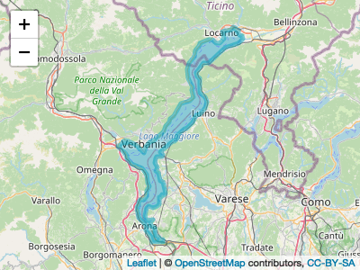

<!-- README.md is generated from README.Rmd. Please edit that file -->

# ReLTER

<!-- badges: start -->

<!-- badges: end -->

Nell’ambito della rete eLTER

## Installation

You can install the development version of ReLTER from
[GitHub](https://github.com/) with:

``` r
# install.packages("devtools")
devtools::install_github("oggioniale/ReLTER")
```

## Examples

An examples of the possible capabilities of this library is given below.
In these examples you can see interaction, througth API, with DEIMS-SDR.

First example creates a map overlaying the boundaries of the site (Lake
Maggiore) thanks to the information on geographical aspects provided by
DEIMS-SDR. by function getSiteBoundaries.



Second example creates a list of parameters collected by a network
(LTER-Italy) information always gathered from what is indicated in the
different sites on DEIMS-SDR. by function getNetworkParameters

    #>  Found 1 records... Imported 1 records. Simplifying...
    #>  Found 1 records... Imported 1 records. Simplifying...
    #>  Found 1 records... Imported 1 records. Simplifying...
    #>  Found 1 records... Imported 1 records. Simplifying...
    #>  Found 1 records... Imported 1 records. Simplifying...
    #>  Found 1 records... Imported 1 records. Simplifying...
    #>  Found 1 records... Imported 1 records. Simplifying...
    #>  Found 1 records... Imported 1 records. Simplifying...
    #>  Found 1 records... Imported 1 records. Simplifying...
    #>  Found 1 records... Imported 1 records. Simplifying...
    #>  Found 1 records... Imported 1 records. Simplifying...
    #>  Found 1 records... Imported 1 records. Simplifying...
    #>  Found 1 records... Imported 1 records. Simplifying...
    #>  Found 1 records... Imported 1 records. Simplifying...
    #>  Found 1 records... Imported 1 records. Simplifying...
    #>  Found 1 records... Imported 1 records. Simplifying...
    #>  Found 1 records... Imported 1 records. Simplifying...
    #>  Found 1 records... Imported 1 records. Simplifying...
    #>  Found 1 records... Imported 1 records. Simplifying...
    #>  Found 1 records... Imported 1 records. Simplifying...
    #>  Found 1 records... Imported 1 records. Simplifying...
    #>  Found 1 records... Imported 1 records. Simplifying...
    #>  Found 1 records... Imported 1 records. Simplifying...
    #>  Found 1 records... Imported 1 records. Simplifying...
    #>  Found 1 records... Imported 1 records. Simplifying...
    #>  Found 1 records... Imported 1 records. Simplifying...
    #>  Found 1 records... Imported 1 records. Simplifying...
    #>  Found 1 records... Imported 1 records. Simplifying...
    #>  Found 1 records... Imported 1 records. Simplifying...
    #>  Found 1 records... Imported 1 records. Simplifying...
    #>  Found 1 records... Imported 1 records. Simplifying...
    #>  Found 1 records... Imported 1 records. Simplifying...
    #>  Found 1 records... Imported 1 records. Simplifying...
    #>  Found 1 records... Imported 1 records. Simplifying...
    #>  Found 1 records... Imported 1 records. Simplifying...
    #>  Found 1 records... Imported 1 records. Simplifying...
    #>  Found 1 records... Imported 1 records. Simplifying...
    #>  Found 1 records... Imported 1 records. Simplifying...
    #>  Found 1 records... Imported 1 records. Simplifying...
    #>  Found 1 records... Imported 1 records. Simplifying...
    #>  Found 1 records... Imported 1 records. Simplifying...
    #>  Found 1 records... Imported 1 records. Simplifying...
    #>  Found 1 records... Imported 1 records. Simplifying...
    #>  Found 1 records... Imported 1 records. Simplifying...
    #>  Found 1 records... Imported 1 records. Simplifying...
    #>  Found 1 records... Imported 1 records. Simplifying...
    #>  Found 1 records... Imported 1 records. Simplifying...
    #>  Found 1 records... Imported 1 records. Simplifying...
    #>  Found 1 records... Imported 1 records. Simplifying...
    #>  Found 1 records... Imported 1 records. Simplifying...
    #>  Found 1 records... Imported 1 records. Simplifying...
    #>  Found 1 records... Imported 1 records. Simplifying...
    #>  Found 1 records... Imported 1 records. Simplifying...
    #>  Found 1 records... Imported 1 records. Simplifying...
    #>  Found 1 records... Imported 1 records. Simplifying...
    #>  Found 1 records... Imported 1 records. Simplifying...
    #>  Found 1 records... Imported 1 records. Simplifying...
    #>  Found 1 records... Imported 1 records. Simplifying...
    #>  Found 1 records... Imported 1 records. Simplifying...
    #>  Found 1 records... Imported 1 records. Simplifying...
    #>  Found 1 records... Imported 1 records. Simplifying...
    #>  Found 1 records... Imported 1 records. Simplifying...
    #>  Found 1 records... Imported 1 records. Simplifying...
    #>  Found 1 records... Imported 1 records. Simplifying...
    #>  Found 1 records... Imported 1 records. Simplifying...
    #>  Found 1 records... Imported 1 records. Simplifying...
    #>  Found 1 records... Imported 1 records. Simplifying...
    #>  Found 1 records... Imported 1 records. Simplifying...
    #>  Found 1 records... Imported 1 records. Simplifying...
    #>  Found 1 records... Imported 1 records. Simplifying...
    #>  Found 1 records... Imported 1 records. Simplifying...
    #>  Found 1 records... Imported 1 records. Simplifying...
    #>  Found 1 records... Imported 1 records. Simplifying...
    #>  Found 1 records... Imported 1 records. Simplifying...
    #>  Found 1 records... Imported 1 records. Simplifying...
    #>  Found 1 records... Imported 1 records. Simplifying...
    #>  Found 1 records... Imported 1 records. Simplifying...
    #>  Found 1 records... Imported 1 records. Simplifying...
    #>  Found 1 records... Imported 1 records. Simplifying...
    #>  Found 1 records... Imported 1 records. Simplifying...
    #>  Found 1 records... Imported 1 records. Simplifying...
    #>  Found 1 records... Imported 1 records. Simplifying...
    #>  Found 1 records... Imported 1 records. Simplifying...
    #>  Found 1 records... Imported 1 records. Simplifying...
    #>  Found 1 records... Imported 1 records. Simplifying...
    #>  Found 1 records... Imported 1 records. Simplifying...
    #>  Found 1 records... Imported 1 records. Simplifying...
    #>  Found 1 records... Imported 1 records. Simplifying...
    #>  Found 1 records... Imported 1 records. Simplifying...
    #>  Found 1 records... Imported 1 records. Simplifying...
    #>  Found 1 records... Imported 1 records. Simplifying...
    #>  Found 1 records... Imported 1 records. Simplifying...
    #>  Found 1 records... Imported 1 records. Simplifying...
    #>  Found 1 records... Imported 1 records. Simplifying...
    #>  Found 1 records... Imported 1 records. Simplifying...
    #>  Found 1 records... Imported 1 records. Simplifying...
    #>  Found 1 records... Imported 1 records. Simplifying...
    #>  Found 1 records... Imported 1 records. Simplifying...
    #>  Found 1 records... Imported 1 records. Simplifying...
    #>  Found 1 records... Imported 1 records. Simplifying...
    #>  Found 1 records... Imported 1 records. Simplifying...
    #>  Found 1 records... Imported 1 records. Simplifying...
    #>  Found 1 records... Imported 1 records. Simplifying...
    #>  Found 1 records... Imported 1 records. Simplifying...

| parameterLabel                    | parameterUri                                  |
| :-------------------------------- | :-------------------------------------------- |
| atmospheric parameter             | <http://vocabs.lter-europe.net/EnvThes/20937> |
| ecosystem parameter               | <http://vocabs.lter-europe.net/EnvThes/20939> |
| conductivity                      | <http://vocabs.lter-europe.net/EnvThes/22089> |
| dissolved nutrient                | <http://vocabs.lter-europe.net/EnvThes/22107> |
| dissolved organic carbon in water | <http://vocabs.lter-europe.net/EnvThes/10307> |
| ecosystem structure               | <http://vocabs.lter-europe.net/EnvThes/21475> |
| inorganic nutrient content        | <http://vocabs.lter-europe.net/EnvThes/22137> |
| percent carbon                    | <http://vocabs.lter-europe.net/EnvThes/22181> |
| percent organic carbon            | <http://vocabs.lter-europe.net/EnvThes/22183> |
| total carbon                      | <http://vocabs.lter-europe.net/EnvThes/22296> |
